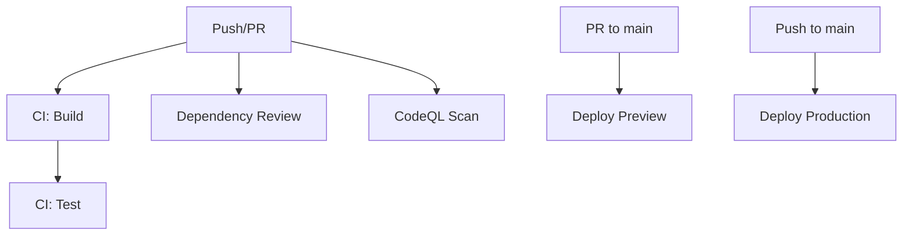

# GitHub Actions Workflows

This document describes all the automated workflows configured for this repository.

## Overview

The repository uses GitHub Actions for continuous integration and deployment. All workflows are located in `.github/workflows/`.

## Workflows

### 1. CI Workflow (`ci.yml`)

**Purpose:** Ensures code quality on every push and pull request

**Triggers:**
- Push to `main` or `develop` branches
- Pull requests to `main` or `develop` branches

**Jobs:**

#### Lint and Build
- Checks out code
- Sets up Node.js 20
- Installs dependencies with `npm ci`
- Runs production build
- Uploads build artifacts (retained for 7 days)

#### Test
- Runs after successful build
- Executes test suite with `npm test`
- Uploads test coverage report
- Coverage available as artifact

**Status:** Required check for merging PRs

**Approximate Duration:** 2-3 minutes

---

### 2. Deploy Preview (`deploy-preview.yml`)

**Purpose:** Creates preview deployments for pull requests

**Triggers:**
- Pull requests to `main` branch

**Jobs:**

#### Deploy Preview
- Checks out code
- Sets up Node.js 20
- Installs Vercel CLI
- Pulls Vercel environment configuration
- Builds project with Vercel
- Deploys to preview environment
- Comments preview URL on the PR

**Required Secrets:**
- `VERCEL_TOKEN`
- `VERCEL_ORG_ID`
- `VERCEL_PROJECT_ID`

**Status:** Informational (not required for merge)

**Approximate Duration:** 3-5 minutes

**Output:** Preview URL commented on PR

---

### 3. Deploy Production (`deploy-production.yml`)

**Purpose:** Deploys to production when code is merged

**Triggers:**
- Push to `main` branch
- Manual workflow dispatch

**Jobs:**

#### Deploy to Production
- Checks out code
- Sets up Node.js 20
- Installs Vercel CLI
- Pulls production environment configuration
- Builds production artifacts
- Deploys to Vercel production
- Creates deployment summary

**Required Secrets:**
- `VERCEL_TOKEN`
- `VERCEL_ORG_ID`
- `VERCEL_PROJECT_ID`

**Environment:** production

**Status:** Critical (monitors production health)

**Approximate Duration:** 3-5 minutes

**Output:** Production URL in workflow summary

---

### 4. CodeQL Security Scan (`codeql.yml`)

**Purpose:** Scans code for security vulnerabilities

**Triggers:**
- Push to `main` branch
- Pull requests to `main` branch
- Weekly schedule (Mondays at midnight UTC)

**Jobs:**

#### Analyze Code
- Initializes CodeQL for JavaScript/TypeScript
- Runs autobuild
- Performs security analysis
- Reports findings to Security tab

**Languages Analyzed:**
- JavaScript
- TypeScript

**Query Suite:** security-and-quality

**Status:** Informational (review findings)

**Approximate Duration:** 5-10 minutes

**Output:** Security alerts in GitHub Security tab

---

### 5. Dependency Review (`dependency-review.yml`)

**Purpose:** Reviews dependencies for security issues and license compliance

**Triggers:**
- Pull requests (any target branch)

**Jobs:**

#### Dependency Review
- Checks out code
- Analyzes dependency changes
- Checks for known vulnerabilities
- Validates license compliance

**Configuration:**
- Fails on: moderate severity or higher
- Denied licenses: GPL-2.0, GPL-3.0

**Status:** Required check for merging PRs

**Approximate Duration:** 1-2 minutes

**Output:** Dependency security report

---

## Required Secrets

Configure these in: **Repository Settings** → **Secrets and variables** → **Actions**

| Secret | Description | Where to Get |
|--------|-------------|--------------|
| `VERCEL_TOKEN` | Vercel authentication token | Vercel Dashboard → Settings → Tokens |
| `VERCEL_ORG_ID` | Vercel organization ID | `.vercel/project.json` after `vercel link` |
| `VERCEL_PROJECT_ID` | Vercel project ID | `.vercel/project.json` after `vercel link` |
| `GEMINI_API_KEY` | Google Gemini API key | Google AI Studio |

## Workflow Dependencies



## Status Badges

Add these to your README.md:

```markdown
[](https://github.com/astickleyid/nXcor/actions/workflows/ci.yml)
[](https://github.com/astickleyid/nXcor/actions/workflows/deploy-production.yml)
[](https://github.com/astickleyid/nXcor/actions/workflows/codeql.yml)
```

## Monitoring Workflows

### View Workflow Runs
1. Go to **Actions** tab in GitHub
2. Select a workflow from the left sidebar
3. View run history and details

### Check Run Status
- Green checkmark: Passed ✅
- Red X: Failed ❌
- Yellow circle: In progress 🔄
- Gray dash: Skipped ⊝

### Debugging Failed Workflows
1. Click on the failed workflow run
2. Click on the failed job
3. Expand steps to see error logs
4. Download artifacts if needed
5. Check secrets are configured correctly

## Workflow Permissions

Workflows use the following permissions:

- **Read**: Repository contents
- **Write**: Pull request comments (for preview URLs)
- **Write**: Security events (for CodeQL)

## Best Practices

### For Contributors
- ✅ Ensure all checks pass before requesting review
- ✅ Address security findings from CodeQL
- ✅ Review dependency changes carefully
- ✅ Test changes in preview deployment
- ✅ Keep commits small and focused

### For Maintainers
- 🔒 Protect required secrets
- 🔄 Keep workflow dependencies updated
- 📊 Monitor workflow success rates
- 🚨 Review security alerts promptly
- 📝 Document workflow changes

## Troubleshooting

### Common Issues

#### Workflow Not Triggering
- Check branch name matches trigger configuration
- Verify workflow file is in `main` branch
- Check workflow is enabled in Actions settings

#### Build Fails
- Verify dependencies are correct in package.json
- Check Node.js version compatibility
- Review build logs for specific errors

#### Deployment Fails
- Verify all required secrets are set
- Check secret values are correct
- Ensure Vercel project is properly configured

#### Tests Fail
- Run tests locally first
- Check for environment-specific issues
- Review test logs in workflow output

#### CodeQL Takes Too Long
- This is normal for large codebases
- Weekly scans run in background
- Can be manually cancelled if needed

## Customizing Workflows

### Changing Node Version
Edit the `node-version` in workflow files:
```yaml
- uses: actions/setup-node@v4
  with:
    node-version: '20'  # Change this
```

### Adding New Workflows
1. Create new `.yml` file in `.github/workflows/`
2. Define triggers and jobs
3. Test with a PR
4. Update this documentation

### Modifying Triggers
Common trigger patterns:
```yaml
# On push to specific branches
on:
  push:
    branches: [main, develop]

# On PR to specific branches
on:
  pull_request:
    branches: [main]

# Scheduled (cron syntax)
on:
  schedule:
    - cron: '0 0 * * 1'  # Weekly on Mondays

# Manual trigger
on:
  workflow_dispatch:
```

## Resources

- [GitHub Actions Documentation](https://docs.github.com/en/actions)
- [Vercel CLI Documentation](https://vercel.com/docs/cli)
- [CodeQL Documentation](https://codeql.github.com/docs/)
- [Workflow Syntax Reference](https://docs.github.com/en/actions/reference/workflow-syntax-for-github-actions)

---

**Last Updated:** December 2024

For questions or issues with workflows, create an issue with the `ci/cd` label.
